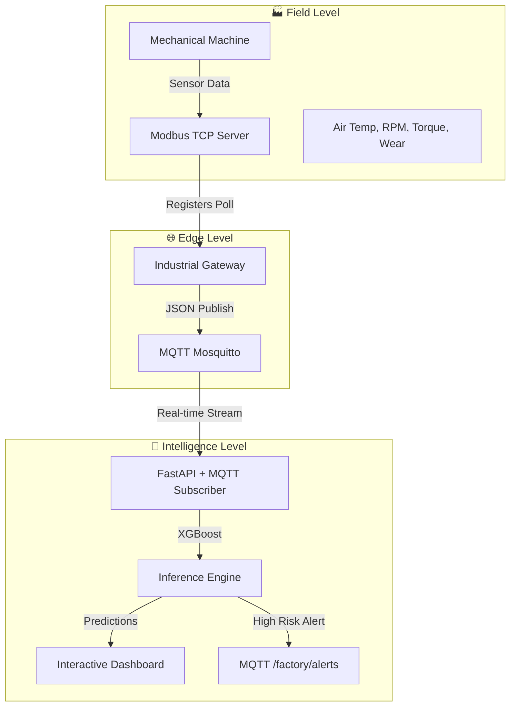

<div align="center">

  # Industrial Machine Failure Prediction System
  **Bridging Industrial Automation (Modbus) and IoT Ecosystems (MQTT) with State-of-the-Art ML Engineering.**
  
  [](https://fastapi.tiangolo.com/)
  [](https://mqtt.org/)
  [](https://modbus.org/)
  [](https://xgboost.ai/)
  [](https://www.docker.com/)
  [](https://www.python.org/)
</div>

---

## Overview

In Industry 4.0, unplanned downtime is a multi-million dollar problem. **Industrial Machine Failure Prediction** is a production-grade solution that demonstrates how to bridge the gap between physical field devices and real-time AI inference.

This project serves as a **Managed IIoT Microservice Architecture** that automates the machine health monitoring lifecycle: from polling Modbus registers in a simulated factory environment to executing predictive diagnostics via a high-performance MQTT telemetry stream.

## Technical Features

- **Industrial Interoperability**: Bi-directional communication between Modbus TCP PLC emulators and MQTT brokers for seamless sensor data ingestion.
- **Predictive Inference Engine**: High-performance XGBoost classifier trained to detect manufacturing failures (Tool Wear, Heat Dissipation, Power, etc.) with high precision.
- **Edge-to-Cloud Pipeline**: Realistic simulation of industrial gateways polling registers and publishing structured JSON telemetry to centralized subscribers.
- **Imbalanced Data Handling**: Specialized ML preprocessing and model weighting to handle rare failure events in a 10,000-sample industrial dataset.
- **Real-time Monitoring**: Professional dashboard for visualizing machine telemetry and AI-driven risk assessment.

## Technology Stack

### Backend & ML
- **Framework**: FastAPI, Uvicorn
- **ML Engine**: XGBoost, Scikit-learn
- **Data Engineering**: Pandas, NumPy
- **Protocols**: PyModbus (Modbus TCP), Paho-MQTT

### Simulation & IoT
- **Field Level**: PLC Emulator (Modbus TCP Server)
- **Gateway Level**: Industrial Gateway (Modbus-to-MQTT Bridge)

### Infrastructure
- **Message Broker**: Eclipse Mosquitto (MQTT)
- **Dashboard**: HTML5, Tailwind CSS, Chart.js

## System Architecture



---

## How to Run (Step-by-Step)

To run the complete end-to-end demonstration, follow these steps in order. Ensure you have a Python virtual environment activated.

### 1. Start the MQTT Broker
Ensure Docker is running, then start the Mosquitto broker:
```bash
docker run -d --name mosquitto -p 1883:1883 eclipse-mosquitto
```

### 2. Start the AI API
This backend handles the predictive logic and health monitoring:
```bash
uvicorn api.main:app --reload
```

### 3. Start the PLC Emulator
Simulates the physical machine and its sensors using Modbus TCP:
```bash
python industrial_iot/plc_emulator.py
```

### 4. Start the Industrial Gateway
The jbridge that polls the PLC and sends data to the MQTT broker:
```bash
python industrial_iot/gateway.py
```

### 5. Launch the Dashboard
Open the monitoring interface in your browser:
```bash
# On Windows
start dashboard.html
```

---

## Industrial IoT Details

### Modbus Register Map
The PLC exposes its internal sensor state via standard Modbus TCP Holding Registers (Slave ID: 1):

| Address | Parameter | Scaling | Description |
| :--- | :--- | :--- | :--- |
| `0000` | Machine Type | ASCII | L (76), M (77), H (72) |
| `0001` | Air Temp | x10 | Ambient Temperature in Kelvin |
| `0002` | Proc Temp | x10 | Internal Process Temperature in Kelvin |
| `0003` | RPM | x1 | Rotational Speed |
| `0004` | Torque | x10 | Applied Spindle Torque (Nm) |
| `0005` | Tool Wear | x1 | Cumulative tool wear (min) |

---

## Author

**Felix Hardyan**
*   [GitHub](https://github.com/flxhrdyn)
