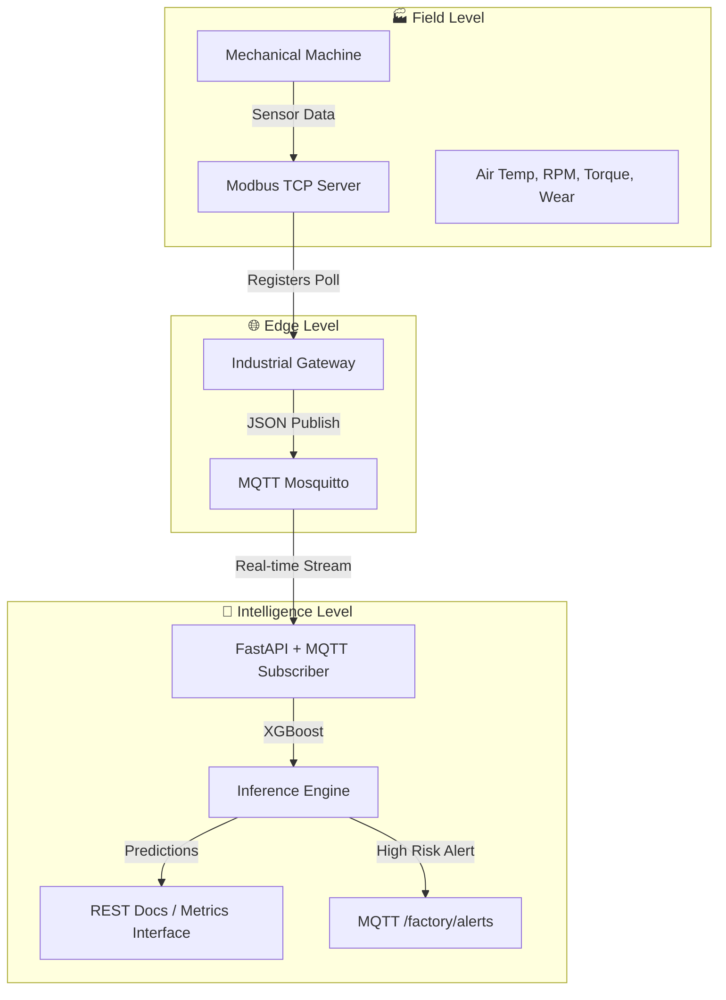

<div align="center">
  # 🏭 IIoT Predictive Maintenance System
  **Bridging Industrial Automation (Modbus) and IoT Ecosystems (MQTT) with State-of-the-Art ML Engineering.**
  
  [](https://fastapi.tiangolo.com/)
  [](https://mqtt.org/)
  [](https://modbus.org/)
  [](https://www.docker.com/)
  [](https://www.python.org/)
</div>

---

## 📖 Overview

In Industry 4.0, unplanned downtime is a multi-million dollar problem. This project demonstrates a production-ready **Predictive Maintenance** solution that connects physical field devices (simulated via Modbus) to an AI-driven inference engine via a high-performance MQTT stream.

This isn't just a model—it's a **Managed IIoT Microservice Architecture**.

## 🏗️ System Architecture



---

## 📊 Model Performance

Our model is trained on a dataset of **10,000 samples**, handling extreme class imbalance with native XGBoost weighting.

### 📈 Core Metrics (on 2,000 hold-out samples)
| Metric | Score | Industrial Impact |
| :--- | :--- | :--- |
| **Accuracy** | **0.97** | Exceptionally stable baseline |
| **Precision (Failure)** | **0.61** | Minimized false-positive maintenance costs |
| **Recall (Failure)** | **0.62** | Captures 2 out of 3 major breakdowns ahead of time |
| **F1-Score** | **0.61** | Balanced performance for imbalanced telemetry |

---

## 📂 Industrial IoT Details

### 📟 Modbus Register Map (PLC Emulator)
The PLC exposes its internal sensor state via standard Modbus TCP Holding Registers (Slave ID: 1):

| Address | Parameter | Scaling | Description |
| :--- | :--- | :--- | :--- |
| `0000` | Machine Type | ASCII | L (76), M (77), H (72) |
| `0001` | Air Temp | x10 | Ambient Temperature in Kelvin |
| `0002` | Proc Temp | x10 | Internal Process Temperature in Kelvin |
| `0003` | RPM | x1 | Rotational Speed |
| `0004` | Torque | x10 | Applied Spindle Torque (Nm) |
| `0005` | Tool Wear | x1 | Cumulative tool wear (min) |

---

## 🚀 Deployment Guide

### **Prerequisites**
*   Python 3.9+ 
*   Docker & Docker Compose

### **Option 1: Full-Stack Orchestration (Recommended)**
Deploy the entire automation environment (Broker, PLC, Gateway, and API) with a single command:
```bash
docker compose --profile simulation up --build
```

### **Option 2: Native Development**
```bash
# Install dependencies
pip install -r requirements.txt

# Train or Retrain the XGBoost Model
python src/train.py

# Start the API
uvicorn api.main:app --reload
```

---

## 🔌 API Usage

### **Real-time Prediction (REST Entrypoint)**
```bash
curl -X POST "http://localhost:8000/predict" \
     -H "Content-Type: application/json" \
     -d '{
       "type": "M",
       "air_temperature_K": 298.1,
       "process_temperature_K": 310.6,
       "rotational_speed_rpm": 1500.0,
       "torque_Nm": 45.0,
       "tool_wear_min": 150
     }'
```

---

## 👨‍💼 Author

**Felix Hardyan**
*   [GitHub](https://github.com/flxhrdyn)
