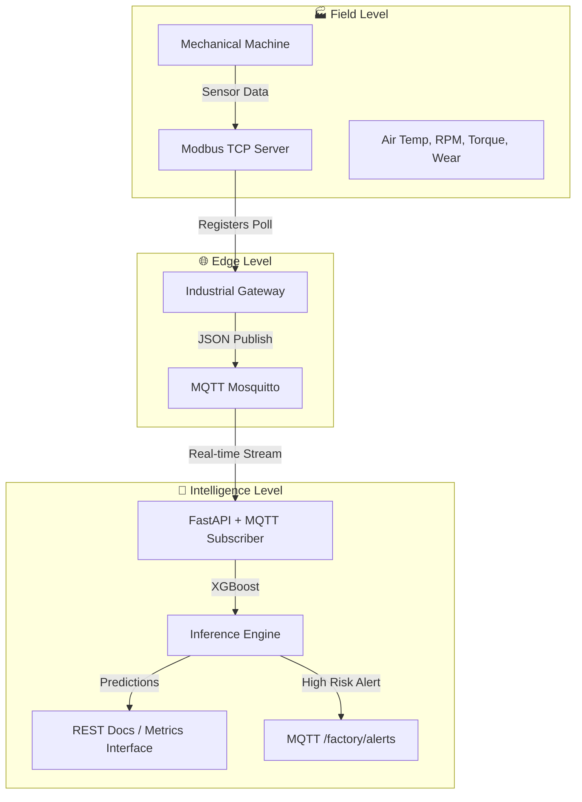

<div align="center">

  # IoT Predictive Maintenance — Industrial Failure Prediction
  **Bridging Industrial Automation (Modbus) and IoT Ecosystems (MQTT) with State-of-the-Art ML Engineering.**
  
  [](https://fastapi.tiangolo.com/)
  [](https://mqtt.org/)
  [](https://modbus.org/)
  [](https://xgboost.ai/)
  [](https://www.docker.com/)
  [](https://www.python.org/)
</div>

---

## Overview

In Industry 4.0, unplanned downtime is a multi-million dollar problem. **IoT Predictive Maintenance** is a production-grade solution that demonstrates how to bridge the gap between physical field devices and real-time AI inference.

This project serves as a **Managed IIoT Microservice Architecture** that automates the machine health monitoring lifecycle: from polling Modbus registers in a simulated factory environment to executing predictive diagnostics via a high-performance MQTT telemetry stream.

## Technical Features

- **Industrial Interoperability**: Bi-directional communication between Modbus TCP PLC emulators and MQTT brokers for seamless sensor data ingestion.
- **Predictive Inference Engine**: High-performance XGBoost classifier trained to detect manufacturing failures (Tool Wear, Heat Dissipation, Power, etc.) with high precision.
- **Edge-to-Cloud Pipeline**: Realistic simulation of industrial gateways polling registers and publishing structured JSON telemetry to centralized subscribers.
- **Imbalanced Data Handling**: Specialized ML preprocessing and model weighting to handle rare failure events in a 10,000-sample industrial dataset.
- **Microservices Deployment**: Fully containerized architecture orchestrated via Docker Compose, including health checks and service dependency management.
- **Real-time REST API**: FastAPI-powered endpoint for on-demand failure prediction with automated Swagger/OpenAPI documentation.

## Technology Stack

### Backend & ML
- **Framework**: FastAPI, Uvicorn
- **ML Engine**: XGBoost, Scikit-learn
- **Data Engineering**: Pandas, NumPy, Imbalanced-learn
- **Protocols**: PyModbus (Modbus TCP), Paho-MQTT

### Simulation & IoT
- **Field Level**: PLC Emulator (Modbus TCP Server)
- **Gateway Level**: Industrial Gateway (Modbus-to-MQTT Bridge)
- **IoT Simulator**: Multi-sensor stress test scripts

### Infrastructure
- **Message Broker**: Eclipse Mosquitto (MQTT)
- **Containerization**: Docker, Docker Compose
- **Orchestration**: Docker Compose Multi-Stage Builds

## System Architecture



---

## Performance & Limits

The system optimizes for high recall to ensure potential failures are captured before they escalate into critical downtime.

### Core Metrics & Operational Limits
| Parameter | Value | Description |
| :--- | :--- | :--- |
| **Model Accuracy** | **0.97** | Exceptionally stable baseline for multi-class failures |
| **Failure Recall** | **0.62** | Effectively captures majority of breakdown events |
| **Data Capacity** | **10,000 pts** | Trained on high-fidelity manufacturing telemetry |
| **Modbus Interface** | **6 Registers** | Mapped to Machine Type, Temps, RPM, Torque, Wear |
| **Inference Latency**| **<50ms** | Ultra-low latency prediction via local XGBoost |

---

## Deployment Guide

### Prerequisites
*   Python 3.9+
*   Docker & Docker Compose

### Execution Options
Deploy the environment using the following standard procedures:

**Option 1: Full-Stack Orchestration (Recommended)**
Deploy the entire automation environment (Broker, PLC, Gateway, and API) with a single command:
```bash
# Deploys with Simulation Profile
docker compose --profile simulation up --build
```

**Option 2: Native Development Mode**
```bash
# 1. Install dependencies
pip install -r requirements.txt

# 2. Train or Retrain the Model
python src/train.py

# 3. Start the API
uvicorn api.main:app --reload
```

## Configuration

The application is configured via environment variables. Key variables include:
- `API_URL`: Target endpoint for the sensor simulator (Default: `http://localhost:8000`).
- `MODBUS_HOST`: Hostname of the PLC emulator (Default: `localhost`).
- `MQTT_HOST`: Hostname of the Mosquitto broker (Default: `localhost`).
- `PYTHONUNBUFFERED`: Ensures logical logs are flushed in real-time.

---

## Industrial IoT Details

### Modbus Register Map
The PLC exposes its internal sensor state via standard Modbus TCP Holding Registers (Slave ID: 1):

| Address | Parameter | Scaling | Description |
| :--- | :--- | :--- | :--- |
| `0000` | Machine Type | ASCII | L (76), M (77), H (72) |
| `0001` | Air Temp | x10 | Ambient Temperature in Kelvin |
| `0002` | Proc Temp | x10 | Internal Process Temperature in Kelvin |
| `0003` | RPM | x1 | Rotational Speed |
| `0004` | Torque | x10 | Applied Spindle Torque (Nm) |
| `0005` | Tool Wear | x1 | Cumulative tool wear (min) |

---

## Author

**Felix Hardyan**
*   [GitHub](https://github.com/flxhrdyn)
