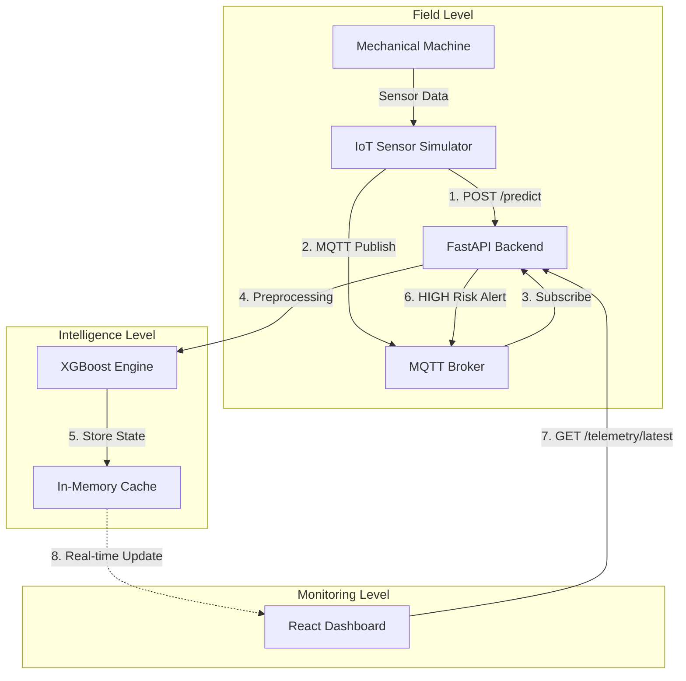

<div align="center">

  # Industrial Machine Failure Prediction System
  **Bridging Industrial Automation and IoT Ecosystems with State-of-the-Art ML Engineering.**
  
  [](https://fastapi.tiangolo.com/)
  [](https://reactjs.org/)
  [](https://www.typescriptlang.org/)
  [](https://tailwindcss.com/)
  [](https://mqtt.org/)
  [](https://xgboost.ai/)
  [](https://www.python.org/)
</div>

---

## Overview

In Industry 4.0, unplanned downtime is a multi-million dollar problem. **Industrial Machine Failure Prediction** is a production-grade solution that demonstrates how to bridge the gap between physical field devices and real-time AI inference.

This project features a **Modular IIoT Microservice Architecture**:
- **Backend**: High-performance FastAPI server and machine simulators.
- **Frontend**: Real-time Asset Performance Dashboard built with React & TypeScript.
- **ML Engine**: Production-ready XGBoost diagnostics.

## Technical Features

- **Predictive Inference Engine**: XGBoost classifier trained to detect manufacturing failures (Tool Wear, Heat Dissipation, Power, etc.) with high precision.
- **Real-time Monitoring**: Professional-grade dashboard for visualizing machine telemetry and AI-driven risk assessment.
- **Dynamic Charting**: Real-time probability drift visualization with threshold-based color alerts.
- **Modern Tech Stack**: Managed with `uv` for Python and Vite for Frontend, ensuring lightning-fast development and execution.
- **Industrial Logic**: Automated maintenance cycle simulation with tool-wear reset logic.

## Technology Stack

### Backend & ML
- **Framework**: FastAPI, Uvicorn (Asynchronous API)
- **Dependency Manager**: Astral `uv` (State-of-the-art Python manager)
- **ML Engine**: XGBoost, Scikit-learn (Pinned v1.6.1 for stability)
- **Protocols**: Paho-MQTT, JSON Telemetry

### Frontend (Dashboard)
- **Framework**: React 18 with Vite
- **Language**: TypeScript (Full Type Safety)
- **Styling**: Tailwind CSS v4, Lucide React Icons
- **Visualization**: Chart.js with optimized real-time rendering

---

## System Architecture



---

## How to Run (Step-by-Step)

### 1. Start the MQTT Broker (Optional)
If you use MQTT features, ensure Docker is running and start Mosquitto:
```bash
docker run -d --name mosquitto -p 1883:1883 eclipse-mosquitto
```

### 2. Run the Backend
Navigate to the backend directory and use `uv` for a one-command startup:
```bash
cd backend
uv run start_backend.py
```
*This starts both the FastAPI server (Port 8000) and the Sensor Simulator.*

### 3. Run the Frontend
Navigate to the frontend directory and start the development server:
```bash
cd frontend
npm install
npm run dev
```
*Access the dashboard at `http://localhost:5173`.*

---

## Project Structure

```text
ds-iot-predictive-maintenance/
├── backend/                # Core Logic & AI Service
│   ├── api/                # FastAPI Endpoints
│   ├── iot_simulator/      # Real-time Sensor Simulation
│   ├── industrial_iot/     # Modbus TCP & Gateway Emulators
│   ├── models/             # Serialized ML Models (.joblib)
│   ├── src/                # Utility & Preprocessing Scripts
│   ├── data/               # Dataset & Raw Telemetry Logs
│   ├── start_backend.py    # Integrated Service Launcher
│   └── pyproject.toml      # Dependency Manifest (uv)
├── frontend/               # React Dashboard (Vite + TS)
│   ├── src/components/     # Modular UI & Metric Cards
│   ├── src/hooks/          # Telemetry Polling Logic
│   └── src/types/          # TypeScript Interfaces
├── notebooks/              # R&D, EDA, and Model Training
├── docker-compose.yml      # Service Orchestration
├── mosquitto.conf          # MQTT Broker Config
└── README.md               # Documentation
```

---

## Industrial IoT Details

### Modbus Register Map
The system is designed to interface with PLC internal sensor states via standard Modbus TCP Holding Registers (Slave ID: 1):

| Address | Parameter | Scaling | Description |
| :--- | :--- | :--- | :--- |
| `0000` | Machine Type | ASCII | L (76), M (77), H (72) |
| `0001` | Air Temp | x10 | Ambient Temperature in Kelvin |
| `0002` | Proc Temp | x10 | Internal Process Temperature in Kelvin |
| `0003` | RPM | x1 | Rotational Speed |
| `0004` | Torque | x10 | Applied Spindle Torque (Nm) |
| `0005` | Tool Wear | x1 | Cumulative tool wear (min) |

---

## Author

**Felix Hardyan**
*   [GitHub](https://github.com/flxhrdyn)
